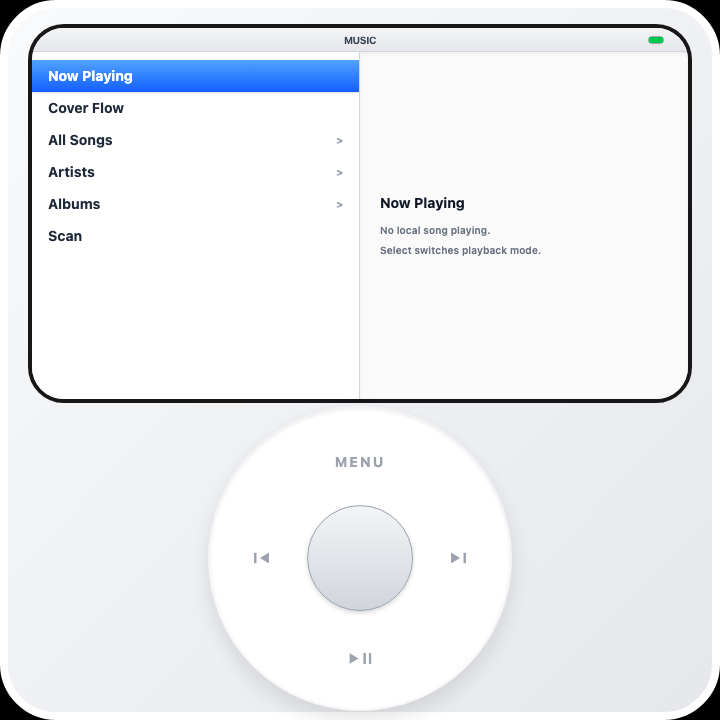

# SquarePod

SquarePod is an Android-first local music player with a classic iPod-style interface. The primary product path is local audio playback: the app scans music files already on the Android device, builds a local library, and plays those files through Android's native `MediaPlayer`.

中文：SquarePod 是一个 Android-first 的本地音乐播放器，界面模拟经典 iPod。当前主路径是本地音频播放：应用扫描 Android 设备上的音乐文件，构建本地资料库，并通过 Android 原生 `MediaPlayer` 播放。

SquarePod does not depend on Apple Music or Spotify for its core playback path. Apple Music and Spotify files still exist in the repository as historical/experimental integration code, but the current verifiable product is Android local media playback.

中文：SquarePod 不依赖 Apple Music 或 Spotify 作为核心播放路径。仓库里仍有 Apple Music / Spotify 历史实验代码，但当前可验证、可交付的产品核心是 Android 本地媒体播放。

## Screenshots / 截图

These screenshots come from the local web preview and show the interface shape. Real music scanning, playback, haptics, Android media permissions, and `.lrc` lyric loading must be verified in the Android APK.

中文：这些截图来自本地 Web 预览，用于展示界面外观。真实音乐扫描、播放、震动反馈、Android 媒体权限和 `.lrc` 歌词读取必须在 Android APK 中验证。

| Main Menu | Music Menu | Now Playing |
| --- | --- | --- |
|  |  |  |

## Current State / 当前状态

Implemented:

- Android local music scanning.
- Android local audio playback.
- Offline playback for copied local audio files.
- Same-name `.lrc` lyric parsing and dynamic Now Playing lyric display.
- Cover Flow grouped by local albums.
- All Songs, Artists, and Albums browsing.
- Now Playing screen with album artwork, progress, playback mode, battery display, and highlighted lyrics.
- Menu-side Now Playing preview with artwork, progress, and the current lyric line.
- Song detail screen before playback.
- Click Wheel navigation with generated UI sounds and native Android haptic ticks.
- Playback queue, current track, and playback position persistence across app restarts.
- Album continuation mode:
  - `Continue: Library`: after an album/artist context ends, continue through the wider local library.
  - `Continue: Album`: stay within the selected album/artist context.
- Playback modes: Sequential, Shuffle, Repeat All, Repeat One.
- Local UI settings for click sound volume, auto scan, backlight, audiobook filtering, EQ, compilation grouping, language, and main menu visibility/order.
- Local Notes, Contacts, and Calendar Events stored in WebView local storage.
- Extras: Sleep Timer, Stopwatch, Screen Lock, Quick Note, Calendar Today / Upcoming / Month View.
- Android MediaStore photo/video scanning.
- Photo grid, photo detail, and local video playback.
- FM Radio UI and native plugin surface.
- UI strings for English, Simplified Chinese, Spanish, Japanese, Korean, French, German, and Brazilian Portuguese.

中文已实现：

- Android 本地音乐扫描。
- Android 本地音频播放。
- 离线播放已复制到设备的本地音频文件。
- 同名 `.lrc` 歌词解析和 Now Playing 动态歌词展示。
- Cover Flow，按本地专辑分组。
- All Songs、Artists、Albums 浏览。
- Now Playing 播放页，包含专辑封面、进度、播放模式、电量显示和歌词高亮。
- 菜单右侧当前播放预览，包含封面、进度和当前歌词行。
- 歌曲播放前详情页。
- Click Wheel 导航、合成 UI 音效和 Android 原生震动 tick。
- 播放队列、当前歌曲和播放位置跨重启恢复。
- Album continuation mode：
  - `Continue: Library`：专辑/艺人上下文结束后继续播放更大的本地资料库。
  - `Continue: Album`：只在当前专辑/艺人上下文内播放。
- 播放模式：Sequential、Shuffle、Repeat All、Repeat One。
- 本地 UI 设置：点击音量、自动扫描、背光、Audiobooks 过滤、EQ、Compilations、语言、主菜单显示和排序。
- 本地 Notes、Contacts、Calendar Events，存储在 WebView local storage。
- Extras：Sleep Timer、Stopwatch、Screen Lock、Quick Note、Calendar Today / Upcoming / Month View。
- Android MediaStore 图片/视频扫描。
- 图片网格、图片详情、本地视频播放。
- FM Radio UI 和原生插件接口。
- 多语言 UI 文案：English、简体中文、Spanish、Japanese、Korean、French、German、Brazilian Portuguese。

Not the current product path:

- Apple Music is not a reliable offline source for SquarePod. Apple controls DRM playback and offline downloads inside Apple Music.
- Spotify is not a reliable offline source for SquarePod. Spotify controls downloaded audio inside Spotify, and App Remote / Web API does not allow SquarePod to cache or directly play it.
- SquarePod does not cache DRM audio from Apple Music, Spotify, or any other streaming service.

中文非当前主路径：

- Apple Music 不是 SquarePod 的可靠离线音源。Apple Music 离线下载和 DRM 播放由 Apple Music app 控制。
- Spotify 不是 SquarePod 的可靠离线音源。Spotify 下载音频受 Spotify app 控制，App Remote / Web API 不允许 SquarePod 直接缓存或播放。
- SquarePod 不缓存 Apple Music、Spotify 或其他流媒体服务的 DRM 音频。

## Platform / 平台

Current target:

- Android through Capacitor.
- Package name: `com.squarepod.app`.

中文当前目标平台：

- Android，通过 Capacitor 打包。
- 包名：`com.squarepod.app`。

Not supported:

- iOS native local music support.
- Desktop packaged app.
- Web-only parity for local music scanning and playback.

中文不支持：

- iOS 原生本地音乐。
- 桌面打包应用。
- Web-only 本地音乐扫描/播放 parity。

The Vite web app is useful for interface development only. Real local music scanning, audio playback, Android permissions, MediaStore access, haptics, and device file access live in the Android native layer.

中文：Vite Web 版只适合界面开发。真实本地音乐扫描、音频播放、系统权限、MediaStore、震动和设备文件读取都在 Android 原生层。

## Requirements / 环境要求

Development machine requirements:

- Node.js 18+. The project has been verified under Node 24.
- npm.
- Android Studio or Android SDK.
- JDK compatible with the current Android Gradle Plugin.
- `adb`, with access to an Android device or emulator.

中文开发环境需要：

- Node.js 18+。当前项目已在 Node 24 环境下验证。
- npm。
- Android Studio 或 Android SDK。
- JDK，版本需满足当前 Android Gradle Plugin 要求。
- `adb` 可用，并能连接 Android 设备或模拟器。

Check local tools:

```sh
node -v
npm -v
adb version
```

Check connected devices:

```sh
adb devices
```

Expected device state:

```text
List of devices attached
ROTATE03434633    device
```

If the device is `unauthorized`, confirm the USB debugging authorization prompt on the Android device. Without a connected device, you can build the APK but cannot install or verify it on hardware.

中文：如果设备显示 `unauthorized`，需要在 Android 设备上确认 USB 调试授权。没有已连接设备时只能构建 APK，不能安装验证。

## Install Dependencies / 安装依赖

Install dependencies after cloning the repository:

```sh
npm install
```

Run the same command after dependency changes.

中文：第一次拉取仓库后执行 `npm install`。依赖变更后也执行同一命令。

## Start The Web Preview / 启动 Web 预览

Start the Vite development server:

```sh
npm run dev
```

The default URL is:

```text
http://localhost:3000
```

If port `3000` is already occupied, choose an explicit port:

```sh
npm run dev -- --port=4179 --host=127.0.0.1
```

Open:

```text
http://127.0.0.1:4179
```

The web preview can validate UI layout, menus, and basic interaction. Do not use it to judge Android local music scanning or playback, because the browser does not provide Android MediaStore or native `MediaPlayer`.

中文：Web 预览能检查 UI、布局、菜单和基础交互。不要用 Web 预览判断本地音乐扫描或播放是否正常，因为浏览器没有 Android MediaStore 和原生 `MediaPlayer`。

## Type Check And Web Build / 类型检查与 Web 构建

Type-check:

```sh
npm run lint
```

Build web assets:

```sh
npm run build
```

Web build output:

```text
dist/
```

中文：`npm run lint` 执行 TypeScript 类型检查，`npm run build` 构建 Web 资源到 `dist/`。

## Sync Capacitor Android Assets / 同步 Capacitor Android 资源

After frontend changes, sync Capacitor assets before building an Android APK:

```sh
npm run android:sync
```

This runs:

```sh
npm run build
cap sync android
```

Synced web assets are copied into:

```text
android/app/src/main/assets/public/
```

If you run Gradle without `android:sync`, the APK may still contain stale frontend assets.

中文：每次修改前端代码后，打 Android 包前必须运行 `npm run android:sync`。如果只运行 Gradle、不运行同步，APK 可能仍然包含旧前端资源。

## Build Debug APK / 构建 Debug APK

Recommended command:

```sh
npm run android:build
```

This runs:

```sh
npm run android:sync
cd android
./gradlew assembleDebug
```

Debug APK output:

```text
android/app/build/outputs/apk/debug/app-debug.apk
```

Manual equivalent:

```sh
npm run android:sync
cd android
./gradlew assembleDebug
```

中文：推荐用 `npm run android:build` 构建 Debug APK，产物位于 `android/app/build/outputs/apk/debug/app-debug.apk`。

## Install Debug APK To Device / 安装 Debug APK 到设备

Check the device:

```sh
adb devices
```

Install:

```sh
adb install -r android/app/build/outputs/apk/debug/app-debug.apk
```

Install to a specific device:

```sh
adb -s <device-id> install -r android/app/build/outputs/apk/debug/app-debug.apk
```

Example:

```sh
adb -s ROTATE03434633 install -r android/app/build/outputs/apk/debug/app-debug.apk
```

Launch:

```sh
adb shell am start -n com.squarepod.app/.MainActivity
```

Launch on a specific device:

```sh
adb -s ROTATE03434633 shell am start -n com.squarepod.app/.MainActivity
```

Force-stop and relaunch:

```sh
adb shell am force-stop com.squarepod.app
adb shell am start -n com.squarepod.app/.MainActivity
```

Check the foreground activity:

```sh
adb shell dumpsys activity activities | rg -n "mResumedActivity|ResumedActivity|com.squarepod.app"
```

You should see `com.squarepod.app/.MainActivity`.

中文：安装前先用 `adb devices` 确认设备在线；安装后用 `am start` 启动；用 `dumpsys activity activities` 确认 `com.squarepod.app/.MainActivity` 在前台。

## Build Release APK / 构建 Release APK

The Android project has a `release` build type, but repository-level signing is not configured.

Build release:

```sh
cd android
./gradlew assembleRelease
```

Typical output:

```text
android/app/build/outputs/apk/release/app-release-unsigned.apk
```

Limits:

- Without release signing, the release APK is not a production-ready distribution package.
- Do not commit keystores, store passwords, or key passwords.
- Production release should inject signing config from a local machine or CI secret store.

中文：当前 Android 工程有 `release` build type，但仓库没有签名配置。未签名 release APK 不能当正式发布包使用。不要把 keystore 或密码提交到仓库。

## Run Through Capacitor / 通过 Capacitor 运行

Capacitor run command:

```sh
npm run android:run
```

It syncs Android assets first, then asks Capacitor to run the Android app.

If automatic device selection fails, use the explicit manual flow:

```sh
npm run android:build
adb devices
adb -s <device-id> install -r android/app/build/outputs/apk/debug/app-debug.apk
adb -s <device-id> shell am start -n com.squarepod.app/.MainActivity
```

中文：`npm run android:run` 会先同步资源再通过 Capacitor 运行。若设备选择失败，使用显式 `adb -s <device-id>` 流程更可控。

## Copy Music To Device / 复制音乐到设备

Recommended public SquarePod folder:

```sh
adb shell mkdir -p /sdcard/Music/SquarePod
adb push "/path/to/music-or-folder" /sdcard/Music/SquarePod/
```

Example:

```sh
adb push "/Users/gigass/Music/QQ音乐" /sdcard/Music/SquarePod/
```

Then open SquarePod and run:

```text
Music -> Scan
```

Alternative app-specific folder:

```sh
adb shell mkdir -p /sdcard/Android/data/com.squarepod.app/files/Music
adb push "/path/to/music-or-folder" /sdcard/Android/data/com.squarepod.app/files/Music/
```

Scan sources:

- Android MediaStore audio library.
- `/sdcard/Android/data/com.squarepod.app/files/Music`
- `/sdcard/Music/SquarePod`

Supported scanner extensions:

- `.mp3`
- `.m4a`
- `.aac`
- `.flac`
- `.wav`
- `.ogg`
- `.opus`

Actual playback support still depends on Android's media stack on the target device.

中文：推荐把音乐放到 `/sdcard/Music/SquarePod`，然后在应用里执行 `Music -> Scan`。扫描支持的扩展名如上，实际能否播放仍取决于目标设备的 Android 媒体栈。

## Add Lyrics / 添加歌词

SquarePod supports same-name `.lrc` sidecar lyrics.

The `.lrc` file must be in the same folder as the audio file and share the same basename:

```text
/sdcard/Music/SquarePod/QQMusic/No more.ogg
/sdcard/Music/SquarePod/QQMusic/No more.lrc
```

Example `.lrc`:

```text
[offset:0]
[00:12.30]First lyric line
[00:16.80]Second lyric line
[00:20.10]Third lyric line
```

Push example:

```sh
adb push "No more.ogg" "/sdcard/Music/SquarePod/QQMusic/"
adb push "No more.lrc" "/sdcard/Music/SquarePod/QQMusic/"
```

Then rescan in the app:

```text
Music -> Scan
```

Important:

- Old cached tracks do not contain lyric data. Rescan after adding `.lrc` files.
- Current `.lrc` reading expects UTF-8.
- Embedded lyric tags are not read.
- Apple Music / Spotify paths do not provide lyric support.

中文：SquarePod 支持同名 `.lrc` 侧车歌词。歌词文件必须和音频同目录、同 basename。添加歌词后需要重新扫描；当前只读取 UTF-8 `.lrc`，不读取内嵌歌词标签，也不支持 Apple Music / Spotify 歌词。

## Photos And Videos / 图片和视频

SquarePod scans photos and videos through Android MediaStore.

Current behavior:

- Requires Android media permissions.
- Reads local device photos and videos.
- Shows a photo grid and photo detail screen.
- Shows video entries and thumbnails when available.
- Plays selected videos through an HTML video element after converting native `file://` / `content://` URIs through Capacitor.

It is a read-only media browser. It does not edit, delete, or cloud-sync media.

中文：SquarePod 通过 Android MediaStore 扫描图片和视频。它是只读媒体浏览器，不编辑、不删除、不云同步。

## FM Radio / FM 收音机

SquarePod includes an FM Radio UI and native plugin surface.

Current behavior:

- Checks wired headset, broadcast hardware, and backend availability.
- Supports status, scan, tune, seek up/down, start, stop, save preset, and delete preset.
- Stores presets and the last tuned frequency locally.

There is no internet radio fallback. If the device has no compatible hardware or backend, the UI reports that directly.

中文：SquarePod 有 FM Radio UI 和原生插件接口，但没有网络电台 fallback。设备没有兼容硬件或 backend 时，UI 会直接报告不可用。

## Scripts / 脚本

| Script | Purpose | 中文 |
| --- | --- | --- |
| `npm run dev` | Start the Vite dev server on port `3000`. | 启动 Vite 开发服务器，默认端口 `3000`。 |
| `npm run lint` | Run TypeScript checking with `tsc --noEmit`. | TypeScript 类型检查。 |
| `npm run build` | Build web assets into `dist/`. | 构建 Web 资源到 `dist/`。 |
| `npm run android:sync` | Build web assets and sync Capacitor Android resources. | 构建 Web 并同步 Capacitor Android 资源。 |
| `npm run android:build` | Sync resources and build the Android Debug APK. | 同步资源并构建 Android Debug APK。 |
| `npm run android:run` | Sync and run the Android app through Capacitor. | 通过 Capacitor 同步并运行 Android app。 |
| `npm run android:open` | Open the Android project. | 打开 Android 工程。 |
| `npm run apple-music:token-server` | Historical Apple Music token server; not the main playback path. | 历史 Apple Music token server，不是当前主播放路径。 |
| `npm run clean` | Remove `dist` and `server.js`. | 删除 `dist` 和 `server.js`。 |

## Architecture / 架构

Important frontend files:

- `src/App.tsx`: app state, navigation stack, playback queue, continuation mode.
- `src/data.tsx`: menu tree for Music, Cover Flow, Artists, Albums, Settings, Extras, Radio, Photos, Videos, Notes, Calendar, Contacts.
- `src/useLocalMusic.ts`: React hook for the native local music plugin.
- `src/useMediaLibrary.ts`: React hook for Android photo/video scanning.
- `src/useRadio.ts`: radio plugin hook and local preset state.
- `src/native/localMusic.ts`: local music plugin TypeScript interface.
- `src/native/mediaLibrary.ts`: Android media library TypeScript interface.
- `src/native/radio.ts`: radio TypeScript interface.
- `src/native/wheelHaptics.ts`: haptic tick TypeScript interface.
- `src/components/Screen.tsx`: iPod screen UI, Cover Flow, Now Playing, lyric display, song detail, battery display.
- `src/components/ClickWheel.tsx`: Click Wheel layout and pointer handling.
- `src/useWheel.ts`: Click Wheel gesture interpretation.
- `src/audio/uiSounds.ts`: wheel and button sounds.
- `src/components/CachedImage.tsx`: renders `file://` and `content://` images through Capacitor-safe URLs.
- `src/i18n.ts`: locale list and UI messages.

中文重要前端文件：

- `src/App.tsx`：应用状态、导航栈、播放队列、继续播放模式。
- `src/data.tsx`：Music、Cover Flow、Artists、Albums、Settings、Extras、Radio、Photos、Videos、Notes、Calendar、Contacts 的菜单树。
- `src/useLocalMusic.ts`：本地音乐原生插件的 React hook。
- `src/useMediaLibrary.ts`：Android 图片/视频扫描 hook。
- `src/useRadio.ts`：Radio 插件 hook 和本地 preset 状态。
- `src/native/localMusic.ts`：本地音乐插件 TypeScript 接口。
- `src/components/Screen.tsx`：iPod 屏幕 UI、Cover Flow、Now Playing、歌词展示、歌曲详情、电量显示。
- `src/components/ClickWheel.tsx`：Click Wheel 布局和指针操作。

Important Android files:

- `android/app/src/main/java/com/squarepod/app/LocalMusicPlugin.java`: local music scanning, metadata, artwork cache, `.lrc` lyric parsing, `MediaPlayer` playback, queue persistence.
- `android/app/src/main/java/com/squarepod/app/MediaLibraryPlugin.java`: Android MediaStore photo/video scanning and thumbnail extraction.
- `android/app/src/main/java/com/squarepod/app/RadioPlugin.java`: hardware radio plugin surface.
- `android/app/src/main/java/com/squarepod/app/WheelHapticsPlugin.java`: native haptic feedback.
- `android/app/src/main/java/com/squarepod/app/DeviceStatusPlugin.java`: battery status bridge.
- `android/app/src/main/java/com/squarepod/app/MainActivity.java`: plugin registration and immersive fullscreen setup.
- `android/app/src/main/AndroidManifest.xml`: permissions, package queries, launcher activity, FileProvider.

中文重要 Android 文件：

- `android/app/src/main/java/com/squarepod/app/LocalMusicPlugin.java`：本地音乐扫描、元数据、封面缓存、`.lrc` 歌词解析、`MediaPlayer` 播放、队列持久化。
- `android/app/src/main/java/com/squarepod/app/MediaLibraryPlugin.java`：Android MediaStore 图片/视频扫描和缩略图提取。
- `android/app/src/main/java/com/squarepod/app/RadioPlugin.java`：硬件 Radio 插件接口。
- `android/app/src/main/java/com/squarepod/app/WheelHapticsPlugin.java`：原生震动反馈。
- `android/app/src/main/java/com/squarepod/app/MainActivity.java`：插件注册和沉浸式全屏配置。

Historical integration files still present:

- `src/services/appleMusic.ts`
- `src/useAppleMusic.ts`
- `src/native/appleMusicAuth.ts`
- `src/native/appleMusicPlayer.ts`
- `android/app/src/main/java/com/squarepod/app/AppleMusicAuthPlugin.java`
- `android/app/src/main/java/com/squarepod/app/AppleMusicPlayerPlugin.java`
- `src/services/spotify.ts`
- `src/services/spotifyAuth.ts`
- `src/services/spotifyLibrary.ts`
- `src/useSpotify.ts`
- `src/native/spotifyRemote.ts`
- `android/app/src/main/java/com/squarepod/app/SpotifyRemotePlugin.java`

These are not the current main product path. Before a clean public release, remove them, isolate them, or redefine their product role.

中文：这些历史集成文件不是当前主产品路径。公开发布前应删除、隔离或重新定义它们的产品角色。

## Permissions / 权限

Audio permissions:

- Android 13+: `READ_MEDIA_AUDIO`
- Android 12 and earlier: `READ_EXTERNAL_STORAGE`

Photo/video permissions:

- Android 13+: `READ_MEDIA_IMAGES`
- Android 13+: `READ_MEDIA_VIDEO`

Other:

- `VIBRATE`: Click Wheel haptic feedback.
- `INTERNET`: still declared because historical Apple Music / Spotify / Capacitor browser paths exist. Local music playback itself does not require network access.

中文权限：

- Android 13+ 音频：`READ_MEDIA_AUDIO`
- Android 12 及更早：`READ_EXTERNAL_STORAGE`
- Android 13+ 图片/视频：`READ_MEDIA_IMAGES`、`READ_MEDIA_VIDEO`
- `VIBRATE`：Click Wheel 震动反馈。
- `INTERNET`：历史 Apple Music / Spotify / Capacitor browser 路径仍存在。本地音乐播放本身不需要网络。

## Troubleshooting / 排障

### `adb devices` shows no device / `adb devices` 没有设备

Check:

- The USB cable supports data transfer.
- Developer Options and USB debugging are enabled.
- The Android device has accepted the RSA authorization prompt.

Restart ADB:

```sh
adb kill-server
adb start-server
adb devices
```

中文：检查 USB 线、开发者选项、USB 调试和 RSA 授权。必要时重启 ADB。

### `INSTALL_FAILED_UPDATE_INCOMPATIBLE`

The device already has the same package name installed with a different signing key. For development, uninstall and reinstall:

```sh
adb uninstall com.squarepod.app
adb install android/app/build/outputs/apk/debug/app-debug.apk
```

This clears app data.

中文：设备上已有同包名但签名不同的 app。开发机上可以卸载后重装，但会清除应用数据。

### APK still shows an old UI / APK 还是旧界面

The usual cause is stale Capacitor assets. Run:

```sh
npm run android:sync
cd android
./gradlew assembleDebug
```

中文：通常是没有同步 Capacitor 资源。先 `android:sync`，再 Gradle 构建。

### Local music does not scan / 本地音乐扫描不到文件

Check:

- Files are under `/sdcard/Music/SquarePod` or the app-specific `Music` folder.
- File extensions are supported.
- Android media permissions are granted.
- `Music -> Scan` was executed.

中文：检查目录、扩展名、媒体权限，并确认已执行 `Music -> Scan`。

### Audio exists but lyrics do not show / 有音频但没有歌词

Check:

- `.lrc` is in the same folder as the audio file.
- `.lrc` has the same basename as the audio file.
- `.lrc` is UTF-8.
- The library was rescanned after adding lyrics.

中文：检查 `.lrc` 是否同目录、同 basename、UTF-8，并确认添加歌词后重新扫描。

### Native features do not work in browser / 浏览器里没有原生能力

This is expected if you opened the Vite page in a desktop browser. Native capabilities only exist inside the Android APK.

中文：如果是在桌面浏览器打开 Vite 页面，这是预期结果。原生能力只存在于 Android APK。

## Verification Flow / 验证流程

Before installing a build:

```sh
npm run lint
npm run android:build
```

Full device verification:

```sh
adb devices
adb install -r android/app/build/outputs/apk/debug/app-debug.apk
adb shell am force-stop com.squarepod.app
adb shell am start -n com.squarepod.app/.MainActivity
adb shell dumpsys activity activities | rg -n "mResumedActivity|ResumedActivity|com.squarepod.app"
```

Collect relevant logs:

```sh
adb logcat -d -t 400 | rg -n "FATAL EXCEPTION|AndroidRuntime|com.squarepod.app|LocalMusic|MediaPlayer" -C 8
```

中文：安装前至少跑 `npm run lint` 和 `npm run android:build`。设备验证时安装、强停、启动，并用 `dumpsys activity` 确认前台 Activity。

## Known Limits / 已知限制

- No streaming-provider audio caching.
- No Apple Music offline playback inside SquarePod.
- No Spotify offline playback guarantee.
- No sidecar cover image scanning such as `cover.jpg`, `folder.jpg`, or `album.png`.
- Lyrics currently support same-name `.lrc` only. Embedded lyric tags are not read.
- No playlist editor.
- No search UI.
- Contacts are app-local only; Android system contacts are not integrated.
- Notes, Contacts, Calendar, menu settings, Stopwatch, and Sleep Timer use WebView local storage, not a native database.
- Calendar reminders are not Android system notifications.
- FM Radio depends on device hardware and backend support. There is no internet radio fallback.
- Photo/video browsing is read-only.
- Local playback quality and codec support depend on Android `MediaPlayer`.
- Historical Apple Music / Spotify integration code still exists and should be cleaned before a public release.

中文已知限制：

- 不缓存流媒体服务音频。
- 不支持 Apple Music 离线播放进入 SquarePod。
- 不保证 Spotify 离线播放。
- 不扫描 `cover.jpg`、`folder.jpg`、`album.png` 这类侧车封面图。
- 当前歌词只支持同名 `.lrc`，不读取内嵌歌词标签。
- 没有 playlist editor。
- 没有搜索 UI。
- Contacts 是 app-local，不接 Android 系统联系人。
- Notes、Contacts、Calendar、菜单设置、Stopwatch、Sleep Timer 存在 WebView local storage，不是原生数据库。
- Calendar reminders 不是 Android 系统通知。
- FM Radio 依赖设备硬件和 backend，没有网络电台 fallback。
- 图片/视频浏览是只读。
- 本地播放质量和 codec 支持取决于 Android `MediaPlayer`。
- 仓库仍包含历史 Apple Music / Spotify 集成代码，公开发布前需要清理。
