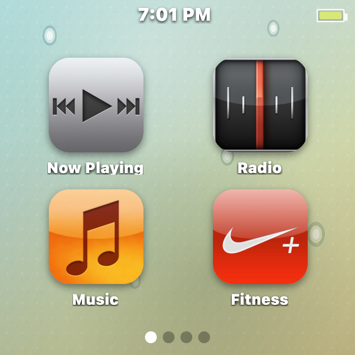
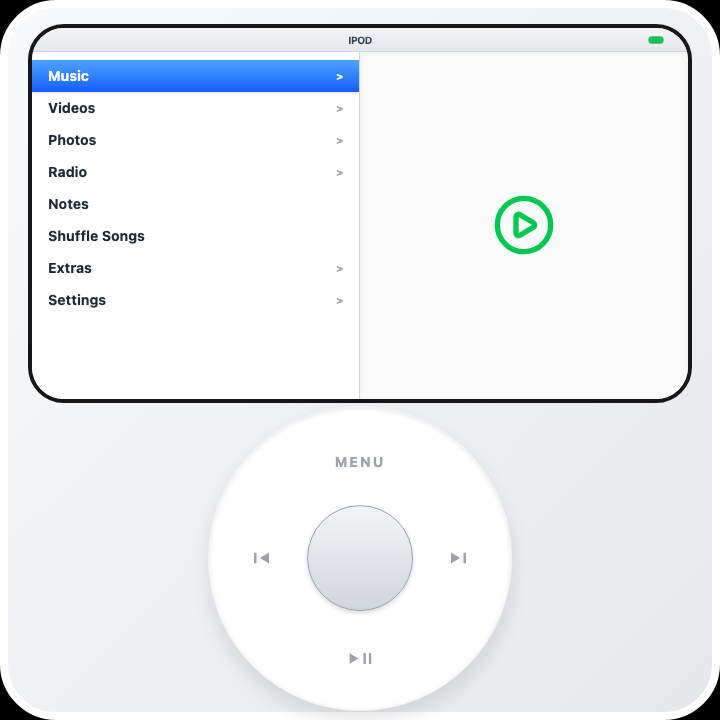
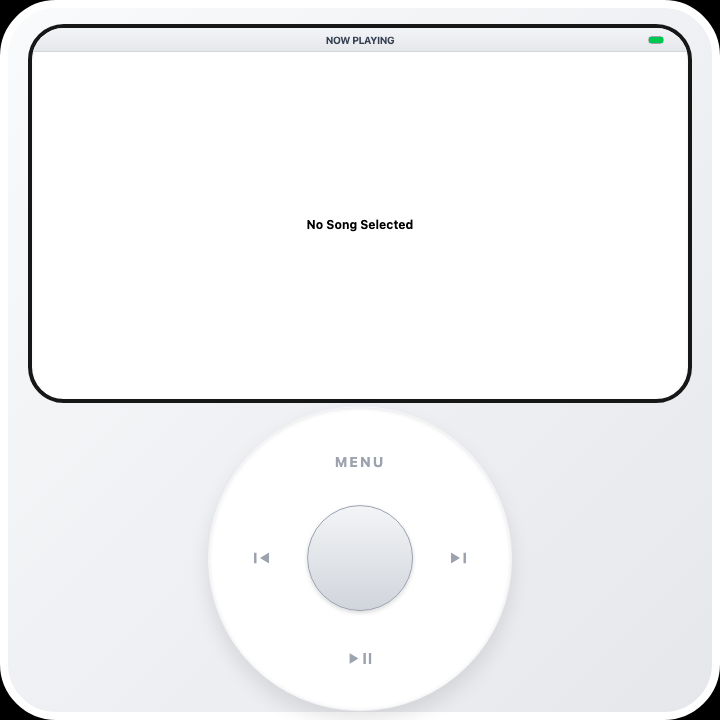

# SquarePod

[English](#english) | [中文](#中文)



## English

SquarePod is an Android-first local music player with two iPod-style interfaces:

- **iPod classic mode:** a Click Wheel interface with Cover Flow, menus, haptics, and classic playback screens.
- **iPod nano 6 mode:** a touch interface with a paged icon home screen, status bar, native-feeling media views, and photo wallpaper support.

The core product path is local Android media playback. SquarePod scans audio files already on the device, builds a local library, and plays them through Android's native media stack. It does not depend on Apple Music or Spotify for playback.

### Screenshots

| iPod nano 6 | Classic Main Menu | Classic Now Playing |
| --- | --- | --- |
|  |  |  |

### Features

- Two device modes: Click Wheel classic and iPod nano 6 touch.
- Android local music scanning from MediaStore and SquarePod music folders.
- Offline playback for local audio files.
- Same-name `.lrc` lyric parsing and synced lyric display.
- Cover Flow grouped by local albums.
- All Songs, Artists, Albums, and Now Playing queue views.
- Playback modes: Sequential, Shuffle, Repeat All, Repeat One.
- Playback position, queue, current track, settings, and app data persistence.
- Native Android haptic feedback for Click Wheel movement.
- Click sound volume, backlight, EQ, compilation grouping, language, control mode, and main menu order settings.
- iPod nano 6 home screen icon paging and icon reordering.
- Photo scanning, photo grid, photo viewer, and iPod nano 6 wallpaper cropping.
- Local video scanning and playback.
- Voice Memos with record, playback, delete, and file refresh actions.
- Books with EPUB/TXT/Markdown import, pasted text, chapters, and reading progress.
- Fitness log with quick presets and history.
- Notes, Contacts, and Calendar stored locally.
- Extras: Sleep Timer, Stopwatch, Screen Lock, Clock, and World Clock.
- FM Radio UI and native plugin surface for devices with compatible hardware/backend support.
- English and Simplified Chinese README sections. The app itself still contains broader UI locale support.

### Platform

Current target:

- Android app through Capacitor.
- Package name: `com.squarepod.app`.

The Vite web preview is for UI development only. Real scanning, playback, MediaStore access, device files, haptics, and Android permissions must be verified inside the Android APK.

Not supported:

- iOS native local music playback.
- Desktop packaged app.
- Streaming-provider audio caching.
- Apple Music or Spotify offline playback inside SquarePod.

### Requirements

- Node.js 18+.
- npm.
- Android Studio or Android SDK.
- JDK compatible with the current Android Gradle Plugin.
- `adb` with an Android device or emulator.

Check tools:

```sh
node -v
npm -v
adb version
adb devices
```

### Install

```sh
npm install
```

Run the same command after dependency changes.

### Web Preview

```sh
npm run dev
```

Default URL:

```text
http://localhost:3000
```

If port `3000` is busy:

```sh
npm run dev -- --port=4179 --host=127.0.0.1
```

### Type Check And Build

```sh
npm run lint
npm run build
```

`npm run lint` runs `tsc --noEmit`. `npm run build` writes web assets to `dist/`.

### Android Build

Build a debug APK:

```sh
npm run android:build
```

This runs the web build, syncs Capacitor assets, and builds:

```text
android/app/build/outputs/apk/debug/app-debug.apk
```

Install and launch:

```sh
adb install -r android/app/build/outputs/apk/debug/app-debug.apk
adb shell am start -n com.squarepod.app/.MainActivity
```

For a specific device:

```sh
adb -s <device-id> install -r android/app/build/outputs/apk/debug/app-debug.apk
adb -s <device-id> shell am start -n com.squarepod.app/.MainActivity
```

### Add Music

Recommended folder:

```sh
adb shell mkdir -p /sdcard/Music/SquarePod
adb push "/path/to/music-or-folder" /sdcard/Music/SquarePod/
```

Then open SquarePod:

```text
Music -> Scan
```

Supported scanner extensions:

- `.mp3`
- `.m4a`
- `.aac`
- `.flac`
- `.wav`
- `.ogg`
- `.opus`

Actual playback support depends on the target device's Android media stack.

### Add Lyrics

SquarePod supports same-name `.lrc` sidecar lyrics.

```text
/sdcard/Music/SquarePod/Song.ogg
/sdcard/Music/SquarePod/Song.lrc
```

Example:

```text
[offset:0]
[00:12.30]First lyric line
[00:16.80]Second lyric line
```

After adding lyrics, run:

```text
Music -> Scan
```

Current limits: UTF-8 `.lrc` files only, no embedded lyric tags.

### Useful Scripts

| Script | Purpose |
| --- | --- |
| `npm run dev` | Start the Vite dev server. |
| `npm run lint` | Run TypeScript checking. |
| `npm run build` | Build web assets into `dist/`. |
| `npm run android:sync` | Build web assets and sync Capacitor Android resources. |
| `npm run android:build` | Sync resources and build the Android debug APK. |
| `npm run android:run` | Sync and run the Android app through Capacitor. |
| `npm run android:open` | Open the Android project. |
| `npm run clean` | Remove `dist` and `server.js`. |

### Important Files

| Path | Purpose |
| --- | --- |
| `src/App.tsx` | App state, navigation, persistence, playback queue, device mode switching. |
| `src/data.tsx` | Menu tree for music, media, settings, extras, notes, calendar, contacts, books, fitness, and radio. |
| `src/components/Screen.tsx` | iPod classic screen UI. |
| `src/components/ClickWheel.tsx` | Classic Click Wheel UI. |
| `src/components/Nano6Screen.tsx` | iPod nano 6 touch UI. |
| `src/useLocalMusic.ts` | React hook for the Android local music plugin. |
| `src/useMediaLibrary.ts` | React hook for Android photo/video scanning. |
| `src/useVoiceMemos.ts` | React hook for voice memo recording and file operations. |
| `src/useRadio.ts` | FM radio hook and local preset state. |
| `src/i18n.ts` | UI message helpers and locale definitions. |
| `android/app/src/main/java/com/squarepod/app/LocalMusicPlugin.java` | Audio scanning, metadata, artwork, lyrics, playback, and queue persistence. |
| `android/app/src/main/java/com/squarepod/app/MediaLibraryPlugin.java` | Android photo/video scanning and thumbnails. |
| `android/app/src/main/java/com/squarepod/app/VoiceMemosPlugin.java` | Voice memo native bridge. |
| `android/app/src/main/java/com/squarepod/app/RadioPlugin.java` | FM radio native bridge surface. |
| `android/app/src/main/java/com/squarepod/app/MainActivity.java` | Plugin registration and fullscreen setup. |

### Known Limits

- No streaming-provider audio caching.
- No Apple Music or Spotify offline playback inside SquarePod.
- No sidecar cover image scanning such as `cover.jpg`, `folder.jpg`, or `album.png`.
- Lyrics support same-name `.lrc` files only.
- Photo/video browsing is read-only.
- Notes, Contacts, Calendar, Books, Fitness, menu settings, Stopwatch, and Sleep Timer use WebView local storage.
- Calendar reminders are not Android system notifications.
- FM Radio depends on device hardware and backend support. There is no internet radio fallback.
- Local playback quality and codec support depend on Android's media stack.

---

## 中文

SquarePod 是一个 Android-first 的本地音乐播放器，提供两种 iPod 风格界面：

- **iPod classic 模式：** Click Wheel 操作、Cover Flow、菜单、震动反馈和经典播放界面。
- **iPod nano 6 模式：** 触摸界面、分页图标主屏、状态栏、媒体浏览界面和照片墙纸。

核心路径是 Android 本地媒体播放。SquarePod 扫描设备上的本地音频文件，构建本地资料库，并通过 Android 原生媒体能力播放。它不依赖 Apple Music 或 Spotify 播放音乐。

### 截图

| iPod nano 6 | Classic 主菜单 | Classic 正在播放 |
| --- | --- | --- |
|  |  |  |

### 功能

- 两种设备模式：Click Wheel classic 和 iPod nano 6 touch。
- 从 Android MediaStore 和 SquarePod 音乐文件夹扫描本地音乐。
- 离线播放本地音频文件。
- 同名 `.lrc` 歌词解析和同步歌词显示。
- 按本地专辑分组的 Cover Flow。
- All Songs、Artists、Albums 和 Now Playing 队列。
- 播放模式：Sequential、Shuffle、Repeat All、Repeat One。
- 播放位置、播放队列、当前歌曲、设置和本地数据持久化。
- Click Wheel 原生 Android 震动反馈。
- 点击音量、背光、EQ、合辑分组、语言、控制模式和主菜单顺序设置。
- iPod nano 6 图标分页和图标重排。
- 照片扫描、照片网格、照片查看和 nano6 墙纸裁剪。
- 本地视频扫描和播放。
- Voice Memos：录音、播放、删除和文件刷新。
- Books：EPUB/TXT/Markdown 导入、粘贴文本、章节和阅读进度。
- Fitness：快速预设和历史记录。
- Notes、Contacts、Calendar 本地存储。
- Extras：Sleep Timer、Stopwatch、Screen Lock、Clock、World Clock。
- FM Radio UI 和原生插件接口，是否可用取决于设备硬件和后端支持。
- README 只保留英文和中文两套内容。应用本身仍保留更多 UI 语言支持。

### 平台

当前目标：

- 通过 Capacitor 打包 Android app。
- 包名：`com.squarepod.app`。

Vite Web 预览只用于界面开发。真实扫描、播放、MediaStore、设备文件、震动和 Android 权限必须在 Android APK 内验证。

不支持：

- iOS 原生本地音乐播放。
- 桌面打包应用。
- 流媒体音频缓存。
- 在 SquarePod 内播放 Apple Music 或 Spotify 离线音频。

### 环境要求

- Node.js 18+。
- npm。
- Android Studio 或 Android SDK。
- 与当前 Android Gradle Plugin 兼容的 JDK。
- `adb`，并连接 Android 设备或模拟器。

检查工具：

```sh
node -v
npm -v
adb version
adb devices
```

### 安装依赖

```sh
npm install
```

依赖变更后也运行同一命令。

### Web 预览

```sh
npm run dev
```

默认地址：

```text
http://localhost:3000
```

如果 `3000` 端口被占用：

```sh
npm run dev -- --port=4179 --host=127.0.0.1
```

### 类型检查和构建

```sh
npm run lint
npm run build
```

`npm run lint` 执行 `tsc --noEmit`。`npm run build` 将 Web 资源输出到 `dist/`。

### Android 构建

构建 Debug APK：

```sh
npm run android:build
```

它会先构建 Web，再同步 Capacitor 资源，最后生成：

```text
android/app/build/outputs/apk/debug/app-debug.apk
```

安装并启动：

```sh
adb install -r android/app/build/outputs/apk/debug/app-debug.apk
adb shell am start -n com.squarepod.app/.MainActivity
```

指定设备：

```sh
adb -s <device-id> install -r android/app/build/outputs/apk/debug/app-debug.apk
adb -s <device-id> shell am start -n com.squarepod.app/.MainActivity
```

### 添加音乐

推荐目录：

```sh
adb shell mkdir -p /sdcard/Music/SquarePod
adb push "/path/to/music-or-folder" /sdcard/Music/SquarePod/
```

然后打开 SquarePod：

```text
Music -> Scan
```

扫描支持的扩展名：

- `.mp3`
- `.m4a`
- `.aac`
- `.flac`
- `.wav`
- `.ogg`
- `.opus`

实际能否播放取决于目标设备的 Android 媒体栈。

### 添加歌词

SquarePod 支持同名 `.lrc` 侧车歌词。

```text
/sdcard/Music/SquarePod/Song.ogg
/sdcard/Music/SquarePod/Song.lrc
```

示例：

```text
[offset:0]
[00:12.30]第一句歌词
[00:16.80]第二句歌词
```

添加歌词后运行：

```text
Music -> Scan
```

当前限制：只读取 UTF-8 `.lrc` 文件，不读取内嵌歌词标签。

### 常用脚本

| 脚本 | 用途 |
| --- | --- |
| `npm run dev` | 启动 Vite 开发服务器。 |
| `npm run lint` | 执行 TypeScript 检查。 |
| `npm run build` | 构建 Web 资源到 `dist/`。 |
| `npm run android:sync` | 构建 Web 并同步 Capacitor Android 资源。 |
| `npm run android:build` | 同步资源并构建 Android Debug APK。 |
| `npm run android:run` | 通过 Capacitor 同步并运行 Android app。 |
| `npm run android:open` | 打开 Android 工程。 |
| `npm run clean` | 删除 `dist` 和 `server.js`。 |

### 重要文件

| 路径 | 用途 |
| --- | --- |
| `src/App.tsx` | 应用状态、导航、持久化、播放队列、设备模式切换。 |
| `src/data.tsx` | 音乐、媒体、设置、Extras、备忘录、日历、联系人、图书、健身、收音机的菜单树。 |
| `src/components/Screen.tsx` | iPod classic 屏幕 UI。 |
| `src/components/ClickWheel.tsx` | Classic Click Wheel UI。 |
| `src/components/Nano6Screen.tsx` | iPod nano 6 触摸 UI。 |
| `src/useLocalMusic.ts` | Android 本地音乐插件的 React hook。 |
| `src/useMediaLibrary.ts` | Android 图片/视频扫描 hook。 |
| `src/useVoiceMemos.ts` | 语音备忘录录音和文件操作 hook。 |
| `src/useRadio.ts` | FM 收音机 hook 和本地预设状态。 |
| `src/i18n.ts` | UI 文案工具和 locale 定义。 |
| `android/app/src/main/java/com/squarepod/app/LocalMusicPlugin.java` | 音频扫描、元数据、封面、歌词、播放和队列持久化。 |
| `android/app/src/main/java/com/squarepod/app/MediaLibraryPlugin.java` | Android 图片/视频扫描和缩略图。 |
| `android/app/src/main/java/com/squarepod/app/VoiceMemosPlugin.java` | 语音备忘录原生桥接。 |
| `android/app/src/main/java/com/squarepod/app/RadioPlugin.java` | FM 收音机原生桥接接口。 |
| `android/app/src/main/java/com/squarepod/app/MainActivity.java` | 插件注册和全屏设置。 |

### 已知限制

- 不缓存流媒体服务音频。
- 不在 SquarePod 内播放 Apple Music 或 Spotify 离线音频。
- 不扫描 `cover.jpg`、`folder.jpg`、`album.png` 这类侧车封面。
- 歌词只支持同名 `.lrc` 文件。
- 图片/视频浏览是只读。
- Notes、Contacts、Calendar、Books、Fitness、菜单设置、Stopwatch、Sleep Timer 使用 WebView local storage。
- Calendar reminders 不是 Android 系统通知。
- FM Radio 依赖设备硬件和后端支持，没有网络电台 fallback。
- 本地播放质量和 codec 支持取决于 Android 媒体栈。
